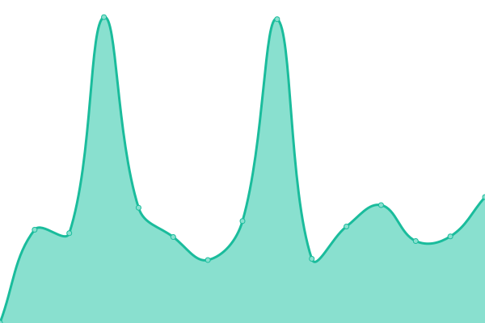
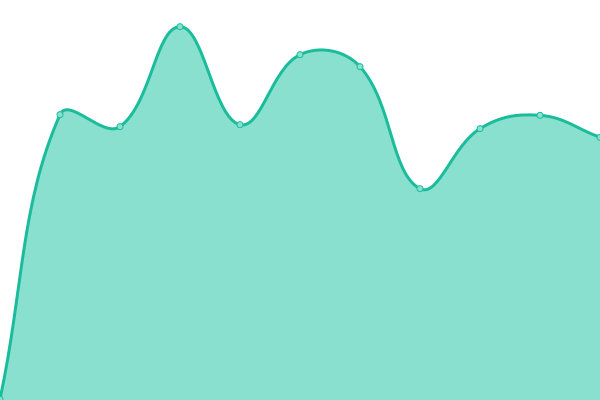
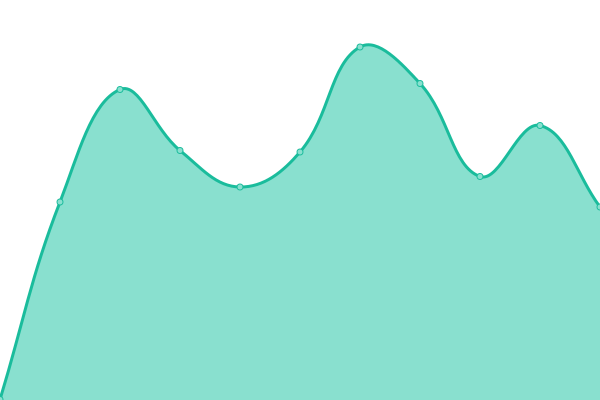
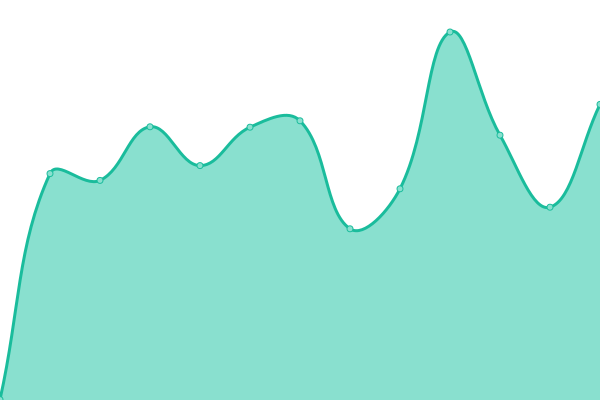
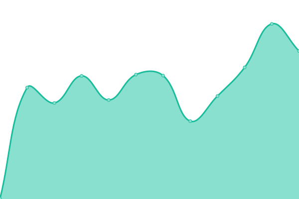
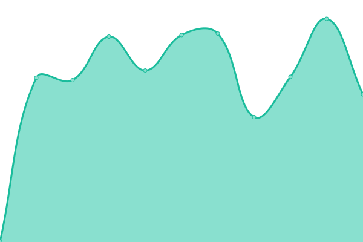
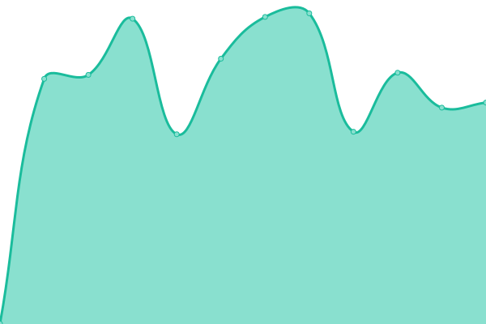

# [📈 Live Status](https://up.nscbox.eu): <!--live status--> **🟩 All systems operational**

This repository contains the open-source uptime monitor and status page for [vp-en](https://up.nscbox.eu), powered by [Upptime](https://github.com/upptime/upptime).

With [Upptime](https://upptime.js.org), you can get your own unlimited and free uptime monitor and status page, powered entirely by a GitHub repository. We use [Issues](https://github.com/vp-en/upptime/issues) as incident reports, [Actions](https://github.com/vp-en/upptime/actions) as uptime monitors, and [Pages](https://up.nscbox.eu) for the status page.

<!--start: status pages-->
<!-- This summary is generated by Upptime (https://github.com/upptime/upptime) -->
<!-- Do not edit this manually, your changes will be overwritten -->
<!-- prettier-ignore -->
| URL | Status | History | Response Time | Uptime |
| --- | ------ | ------- | ------------- | ------ |
|  Plex Server | 🟩 Up | [plex-server.yml](https://github.com/vp-en/upptime/commits/HEAD/history/plex-server.yml) | 

 563ms
     
 | 

<a href="https://up.nscbox.eu/history/plex-server">99.92%</a>
    

|  Bazarr | 🟩 Up | [bazarr.yml](https://github.com/vp-en/upptime/commits/HEAD/history/bazarr.yml) | 

 456ms
     
 | 

<a href="https://up.nscbox.eu/history/bazarr">99.92%</a>
    

|  Bazarr4K | 🟩 Up | [bazarr4-k.yml](https://github.com/vp-en/upptime/commits/HEAD/history/bazarr4-k.yml) | 

 393ms
     
 | 

<a href="https://up.nscbox.eu/history/bazarr4-k">99.92%</a>
    

|  Chatbot | 🟩 Up | [chatbot.yml](https://github.com/vp-en/upptime/commits/HEAD/history/chatbot.yml) | 

 511ms
     
 | 

<a href="https://up.nscbox.eu/history/chatbot">93.59%</a>
    

|  Dashdot | 🟩 Up | [dashdot.yml](https://github.com/vp-en/upptime/commits/HEAD/history/dashdot.yml) | 

 407ms
     
 | 

<a href="https://up.nscbox.eu/history/dashdot">99.92%</a>
    

|  Gotify | 🟩 Up | [gotify.yml](https://github.com/vp-en/upptime/commits/HEAD/history/gotify.yml) | 

 388ms
     
 | 

<a href="https://up.nscbox.eu/history/gotify">99.92%</a>
    

|  Homepage (NSCBOX) | 🟩 Up | [homepage-nscbox.yml](https://github.com/vp-en/upptime/commits/HEAD/history/homepage-nscbox.yml) | 

 730ms
     
 | 

<a href="https://up.nscbox.eu/history/homepage-nscbox">99.92%</a>
    

|  Komga | 🟩 Up | [komga.yml](https://github.com/vp-en/upptime/commits/HEAD/history/komga.yml) | 

 439ms
     
 | 

<a href="https://up.nscbox.eu/history/komga">99.92%</a>
    

|  Lavalink | 🟩 Up | [lavalink.yml](https://github.com/vp-en/upptime/commits/HEAD/history/lavalink.yml) | 

 418ms
     
 | 

<a href="https://up.nscbox.eu/history/lavalink">99.92%</a>
    

|  MusicBot 01 (Carlos) | 🟩 Up | [music-bot-01-carlos.yml](https://github.com/vp-en/upptime/commits/HEAD/history/music-bot-01-carlos.yml) | 

 607ms
     
 | 

<a href="https://up.nscbox.eu/history/music-bot-01-carlos">99.92%</a>
    

|  MusicBot 02 (RedArmy) | 🟩 Up | [music-bot-02-red-army.yml](https://github.com/vp-en/upptime/commits/HEAD/history/music-bot-02-red-army.yml) | 

 557ms
     
 | 

<a href="https://up.nscbox.eu/history/music-bot-02-red-army">99.92%</a>
    

|  Mylar3 | 🟩 Up | [mylar3.yml](https://github.com/vp-en/upptime/commits/HEAD/history/mylar3.yml) | 

 190ms
     
 | 

<a href="https://up.nscbox.eu/history/mylar3">99.92%</a>
    

|  Notifiarr | 🟩 Up | [notifiarr.yml](https://github.com/vp-en/upptime/commits/HEAD/history/notifiarr.yml) | 

 417ms
     
 | 

<a href="https://up.nscbox.eu/history/notifiarr">99.92%</a>
    

|  Overseerr | 🟩 Up | [overseerr.yml](https://github.com/vp-en/upptime/commits/HEAD/history/overseerr.yml) | 

 1007ms
     
 | 

<a href="https://up.nscbox.eu/history/overseerr">99.92%</a>
    

|  Prowlarr | 🟩 Up | [prowlarr.yml](https://github.com/vp-en/upptime/commits/HEAD/history/prowlarr.yml) | 

 564ms
     
 | 

<a href="https://up.nscbox.eu/history/prowlarr">99.92%</a>
    

|  Pterodactyl Panel | 🟩 Up | [pterodactyl-panel.yml](https://github.com/vp-en/upptime/commits/HEAD/history/pterodactyl-panel.yml) | 

 444ms
     
 | 

<a href="https://up.nscbox.eu/history/pterodactyl-panel">99.92%</a>
    

|  Pterodactyl Node | 🟩 Up | [pterodactyl-node.yml](https://github.com/vp-en/upptime/commits/HEAD/history/pterodactyl-node.yml) | 

 370ms
     
 | 

<a href="https://up.nscbox.eu/history/pterodactyl-node">99.93%</a>
    

|  qBittorrent | 🟩 Up | [q-bittorrent.yml](https://github.com/vp-en/upptime/commits/HEAD/history/q-bittorrent.yml) | 

 416ms
     
 | 

<a href="https://up.nscbox.eu/history/q-bittorrent">99.93%</a>
    

|  Radarr | 🟩 Up | [radarr.yml](https://github.com/vp-en/upptime/commits/HEAD/history/radarr.yml) | 

 506ms
     
 | 

<a href="https://up.nscbox.eu/history/radarr">99.93%</a>
    

|  Radarr4K | 🟩 Up | [radarr4-k.yml](https://github.com/vp-en/upptime/commits/HEAD/history/radarr4-k.yml) | 

 613ms
     
 | 

<a href="https://up.nscbox.eu/history/radarr4-k">99.93%</a>
    

|  SABnzbd | 🟩 Up | [sa-bnzbd.yml](https://github.com/vp-en/upptime/commits/HEAD/history/sa-bnzbd.yml) | 

 497ms
     
 | 

<a href="https://up.nscbox.eu/history/sa-bnzbd">99.93%</a>
    

|  SABnzbd (Comics) | 🟩 Up | [sa-bnzbd-comics.yml](https://github.com/vp-en/upptime/commits/HEAD/history/sa-bnzbd-comics.yml) | 

 513ms
     
 | 

<a href="https://up.nscbox.eu/history/sa-bnzbd-comics">99.93%</a>
    

|  Sonarr | 🟩 Up | [sonarr.yml](https://github.com/vp-en/upptime/commits/HEAD/history/sonarr.yml) | 

 520ms
     
 | 

<a href="https://up.nscbox.eu/history/sonarr">99.93%</a>
    

|  Sonarr4K | 🟩 Up | [sonarr4-k.yml](https://github.com/vp-en/upptime/commits/HEAD/history/sonarr4-k.yml) | 

 510ms
     
 | 

<a href="https://up.nscbox.eu/history/sonarr4-k">99.93%</a>
    

|  Tautulli | 🟩 Up | [tautulli.yml](https://github.com/vp-en/upptime/commits/HEAD/history/tautulli.yml) | 

 634ms
     
 | 

<a href="https://up.nscbox.eu/history/tautulli">99.93%</a>
    

|  Whisparr | 🟩 Up | [whisparr.yml](https://github.com/vp-en/upptime/commits/HEAD/history/whisparr.yml) | 

 525ms
     
 | 

<a href="https://up.nscbox.eu/history/whisparr">99.93%</a>
    

|  Wizarr | 🟩 Up | [wizarr.yml](https://github.com/vp-en/upptime/commits/HEAD/history/wizarr.yml) | 

 640ms
     
 | 

<a href="https://up.nscbox.eu/history/wizarr">99.93%</a>
    

|  Wrapperr | 🟩 Up | [wrapperr.yml](https://github.com/vp-en/upptime/commits/HEAD/history/wrapperr.yml) | 

 754ms
     
 | 

<a href="https://up.nscbox.eu/history/wrapperr">99.93%</a>
    

<!--end: status pages-->

[**Visit our status website →**](https://up.nscbox.eu)

## 📄 License

- Powered by: [Upptime](https://github.com/upptime/upptime)
- Code: [MIT](./LICENSE) © [vp-en](https://up.nscbox.eu)
- Data in the `./history` directory: [Open Database License](https://opendatacommons.org/licenses/odbl/1-0/)
