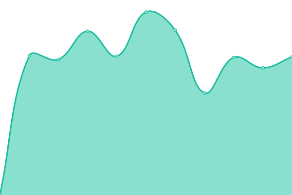
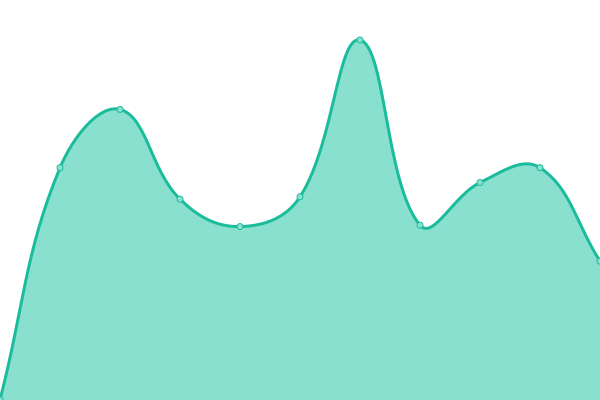
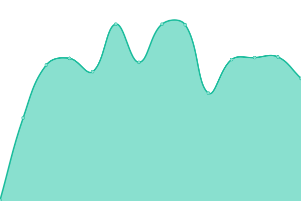
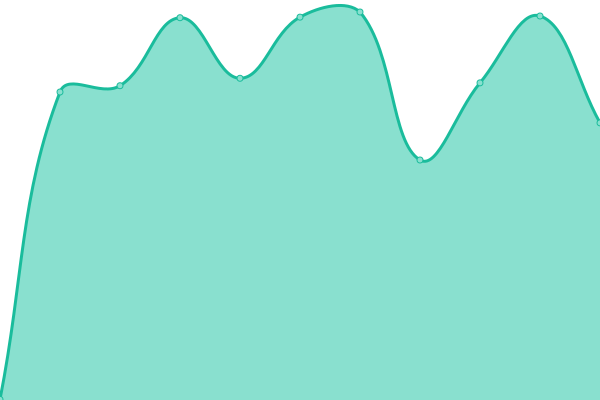

# [📈 Live Status](https://up.nscbox.eu): <!--live status--> **🟧 Partial outage**

This repository contains the open-source uptime monitor and status page for [vp-en](https://up.nscbox.eu), powered by [Upptime](https://github.com/upptime/upptime).

With [Upptime](https://upptime.js.org), you can get your own unlimited and free uptime monitor and status page, powered entirely by a GitHub repository. We use [Issues](https://github.com/vp-en/upptime/issues) as incident reports, [Actions](https://github.com/vp-en/upptime/actions) as uptime monitors, and [Pages](https://up.nscbox.eu) for the status page.

<!--start: status pages-->
<!-- This summary is generated by Upptime (https://github.com/upptime/upptime) -->
<!-- Do not edit this manually, your changes will be overwritten -->
<!-- prettier-ignore -->
| URL | Status | History | Response Time | Uptime |
| --- | ------ | ------- | ------------- | ------ |
|  Plex Server | 🟩 Up | [plex-server.yml](https://github.com/vp-en/upptime/commits/HEAD/history/plex-server.yml) | 

 804ms
     
 | 

<a href="https://up.nscbox.eu/history/plex-server">96.84%</a>
    

|  Bazarr | 🟩 Up | [bazarr.yml](https://github.com/vp-en/upptime/commits/HEAD/history/bazarr.yml) | 

 511ms
     
 | 

<a href="https://up.nscbox.eu/history/bazarr">95.75%</a>
    

|  Bazarr4K | 🟩 Up | [bazarr4-k.yml](https://github.com/vp-en/upptime/commits/HEAD/history/bazarr4-k.yml) | 

 440ms
     
 | 

<a href="https://up.nscbox.eu/history/bazarr4-k">95.75%</a>
    

|  Chatbot | 🟥 Down | [chatbot.yml](https://github.com/vp-en/upptime/commits/HEAD/history/chatbot.yml) | 

 632ms
     
 | 

<a href="https://up.nscbox.eu/history/chatbot">70.54%</a>
    

|  Dashdot | 🟩 Up | [dashdot.yml](https://github.com/vp-en/upptime/commits/HEAD/history/dashdot.yml) | 

 448ms
     
 | 

<a href="https://up.nscbox.eu/history/dashdot">97.27%</a>
    

|  Gotify | 🟩 Up | [gotify.yml](https://github.com/vp-en/upptime/commits/HEAD/history/gotify.yml) | 

 439ms
     
 | 

<a href="https://up.nscbox.eu/history/gotify">97.18%</a>
    

|  Homepage (NSCBOX) | 🟩 Up | [homepage-nscbox.yml](https://github.com/vp-en/upptime/commits/HEAD/history/homepage-nscbox.yml) | 

 806ms
     
 | 

<a href="https://up.nscbox.eu/history/homepage-nscbox">98.93%</a>
    

|  Komga | 🟩 Up | [komga.yml](https://github.com/vp-en/upptime/commits/HEAD/history/komga.yml) | 

 521ms
     
 | 

<a href="https://up.nscbox.eu/history/komga">97.11%</a>
    

|  Lavalink | 🟩 Up | [lavalink.yml](https://github.com/vp-en/upptime/commits/HEAD/history/lavalink.yml) | 

 822ms
     
 | 

<a href="https://up.nscbox.eu/history/lavalink">97.11%</a>
    

|  MusicBot 01 (Carlos) | 🟥 Down | [music-bot-01-carlos.yml](https://github.com/vp-en/upptime/commits/HEAD/history/music-bot-01-carlos.yml) | 

 618ms
     
 | 

<a href="https://up.nscbox.eu/history/music-bot-01-carlos">92.42%</a>
    

|  MusicBot 02 (RedArmy) | 🟥 Down | [music-bot-02-red-army.yml](https://github.com/vp-en/upptime/commits/HEAD/history/music-bot-02-red-army.yml) | 

 649ms
     
 | 

<a href="https://up.nscbox.eu/history/music-bot-02-red-army">93.09%</a>
    

|  Mylar3 | 🟥 Down | [mylar3.yml](https://github.com/vp-en/upptime/commits/HEAD/history/mylar3.yml) | 

 210ms
     
 | 

<a href="https://up.nscbox.eu/history/mylar3">93.09%</a>
    

|  Notifiarr | 🟥 Down | [notifiarr.yml](https://github.com/vp-en/upptime/commits/HEAD/history/notifiarr.yml) | 

 572ms
     
 | 

<a href="https://up.nscbox.eu/history/notifiarr">95.75%</a>
    

|  Overseerr | 🟩 Up | [overseerr.yml](https://github.com/vp-en/upptime/commits/HEAD/history/overseerr.yml) | 

 1140ms
     
 | 

<a href="https://up.nscbox.eu/history/overseerr">96.30%</a>
    

|  Prowlarr | 🟩 Up | [prowlarr.yml](https://github.com/vp-en/upptime/commits/HEAD/history/prowlarr.yml) | 

 624ms
     
 | 

<a href="https://up.nscbox.eu/history/prowlarr">96.51%</a>
    

|  Pterodactyl Panel | 🟩 Up | [pterodactyl-panel.yml](https://github.com/vp-en/upptime/commits/HEAD/history/pterodactyl-panel.yml) | 

 592ms
     
 | 

<a href="https://up.nscbox.eu/history/pterodactyl-panel">97.80%</a>
    

|  Pterodactyl Node | 🟩 Up | [pterodactyl-node.yml](https://github.com/vp-en/upptime/commits/HEAD/history/pterodactyl-node.yml) | 

 449ms
     
 | 

<a href="https://up.nscbox.eu/history/pterodactyl-node">96.98%</a>
    

|  qBittorrent | 🟩 Up | [q-bittorrent.yml](https://github.com/vp-en/upptime/commits/HEAD/history/q-bittorrent.yml) | 

 438ms
     
 | 

<a href="https://up.nscbox.eu/history/q-bittorrent">96.62%</a>
    

|  Radarr | 🟩 Up | [radarr.yml](https://github.com/vp-en/upptime/commits/HEAD/history/radarr.yml) | 

 633ms
     
 | 

<a href="https://up.nscbox.eu/history/radarr">96.12%</a>
    

|  Radarr4K | 🟩 Up | [radarr4-k.yml](https://github.com/vp-en/upptime/commits/HEAD/history/radarr4-k.yml) | 

 601ms
     
 | 

<a href="https://up.nscbox.eu/history/radarr4-k">95.82%</a>
    

|  SABnzbd | 🟩 Up | [sa-bnzbd.yml](https://github.com/vp-en/upptime/commits/HEAD/history/sa-bnzbd.yml) | 

 586ms
     
 | 

<a href="https://up.nscbox.eu/history/sa-bnzbd">96.43%</a>
    

|  SABnzbd (Comics) | 🟩 Up | [sa-bnzbd-comics.yml](https://github.com/vp-en/upptime/commits/HEAD/history/sa-bnzbd-comics.yml) | 

 581ms
     
 | 

<a href="https://up.nscbox.eu/history/sa-bnzbd-comics">100.00%</a>
    

|  Sonarr | 🟩 Up | [sonarr.yml](https://github.com/vp-en/upptime/commits/HEAD/history/sonarr.yml) | 

 575ms
     
 | 

<a href="https://up.nscbox.eu/history/sonarr">100.00%</a>
    

|  Sonarr4K | 🟩 Up | [sonarr4-k.yml](https://github.com/vp-en/upptime/commits/HEAD/history/sonarr4-k.yml) | 

 595ms
     
 | 

<a href="https://up.nscbox.eu/history/sonarr4-k">100.00%</a>
    

|  Tautulli | 🟥 Down | [tautulli.yml](https://github.com/vp-en/upptime/commits/HEAD/history/tautulli.yml) | 

 728ms
     
 | 

<a href="https://up.nscbox.eu/history/tautulli">100.00%</a>
    

|  Whisparr | 🟥 Down | [whisparr.yml](https://github.com/vp-en/upptime/commits/HEAD/history/whisparr.yml) | 

 609ms
     
 | 

<a href="https://up.nscbox.eu/history/whisparr">100.00%</a>
    

|  Wizarr | 🟩 Up | [wizarr.yml](https://github.com/vp-en/upptime/commits/HEAD/history/wizarr.yml) | 

 701ms
     
 | 

<a href="https://up.nscbox.eu/history/wizarr">100.00%</a>
    

|  Wrapperr | 🟩 Up | [wrapperr.yml](https://github.com/vp-en/upptime/commits/HEAD/history/wrapperr.yml) | 

 435ms
     
 | 

<a href="https://up.nscbox.eu/history/wrapperr">100.00%</a>
    

<!--end: status pages-->

[**Visit our status website →**](https://up.nscbox.eu)

## 📄 License

- Powered by: [Upptime](https://github.com/upptime/upptime)
- Code: [MIT](./LICENSE) © [vp-en](https://up.nscbox.eu)
- Data in the `./history` directory: [Open Database License](https://opendatacommons.org/licenses/odbl/1-0/)
